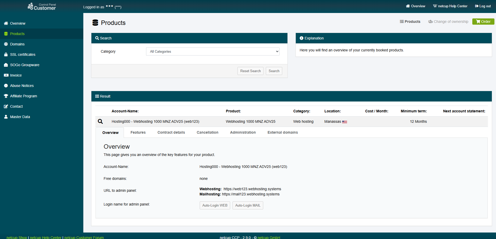

# Introduction

Netcup Webhosting offers a powerful hosting environment based on Plesk/Onyx. However, the native "Let's Encrypt" extension often requires manual DNS verification for Wildcard Certificates (e.g., *.example.com), and does not support automatic renewal.

This tutorial provides a containerized solution to automate the deployment of locally generated SSL certificates (e.g., generated via acme.sh on a separate server) directly to your Netcup Webhosting account.

Using Playwright (a browser automation tool), this solution simulates a real user login to the Customer Control Panel (CCP), handles 2FA, jumps to the Webhosting panel, and uploads the certificates automatically.

# Requirements

* Netcup CCP Credentials, ensure 2FA is enabled
* A Linux Server/VPS (separate from the webhosting) with:
    * Docker or Podman installed.
    * `acme.sh` configured to generate certificates.
* Python 3.12 (if running without Docker).

Theoretically, `acme.sh` can be run within the webhosting chroot environment. However, the absence of `OpenSSL` and crontab may require workarounds to compensate for `OpenSSL`. Automated renewals could then be handled using scheduled tasks. This approach is beyond the scope of this tutorial and will not be elaborated upon.

# Step 1 - Understand the Automation Logic

The provided automation script performs the following actions:

1. Environment Setup: Loads credentials and configuration from environment variables.
2. CCP Login: access customercontrolpanel.de, enters credentials, and generates a TOTP code for 2FA verification using pyotp.
3. SSO Jump: Navigates to your product list and uses the "Auto-Login" feature to jump into the hosting control panel (Plesk) without re-entering passwords.
4. Certificate Upload:
    * Reads your certificate (cert.pem) and private key (key.pem) from a local directory.
    * Navigates to the SSL/TLS settings page for both Web and Mail services.
    * Uploads the new certificate.
5. Apply Settings:
    * Assigns the new certificate to your main domain and specified subdomains.
    * Updates the "Secure Mail" settings to ensure mail services use the valid certificate.

# Step 2 - Retrieve Necessary IDs and Configuration

To configure the script, you need to retrieve several IDs from the Netcup CCP and the Hosting Panel.



1. Log in to Netcup CCP.
2. NC_PRODUCT_ID: Go to "Products". `Hosting000` in the **Account-Name** is your NC_PRODUCT_ID.

# Step 3 -  Prepare the Docker Environment

I recommend run this automation using Podman or Docker.

If you wish to build the image yourself, you can find `Containerfile` at this [repo](https://github.com/keiminic/sync-acme-to-nc)

# Step 4 - Configuration

Create a `.env` file. Warning: This file contains sensitive credentials. Ensure file permissions are restricted (e.g., `chmod 600 .env`).

```ini,TOML
# Netcup Login Credentials
NC_USER=123456                  # Your Customer Number
NC_PASS=your_secure_password    # Your password
NC_2FA_SECRET=JBSWY3DPEHPK3PXP  # Your TOTP Secret Key (NOT the 6-digit code)

# CCP Product ID
NC_PRODUCT_ID=Hosting000

# Domain and ssl
NC_DOMAIN=example.com
SSL_PRIVATE_KEY=/data/key.pem
SSL_CERT_KEY=/data/cert.pem
```

Note on `NC_2FA_SECRET`: When setting up 2FA in Netcup CCP, you must save the "Secret Key" (a string of characters) provided alongside the QR code. If you only scanned the QR code, you may need to reset your 2FA to get this key.

# Step 5 - Running the Automation

Assuming your certificates are located at `/path/to/keyfile/in/nginx/`, you can run the container using **Podman**:

```bash
podman run -it --rm \
  --ipc=host \
  --env-file .env \
  -v /path/to/fullchain/nginx/cert.pem:/data/cert.pem:ro \
  -v /path/to/keyfile/in/nginx/key.pem:/data/key.pem:ro \
  ghcr.io/keiminic/sync-acme-to-nc:latest
```

## Without using container

```bash
git clone https://github.com/keiminic/sync-acme-to-nc.git
cd sync-acme-to-nc
python -m venv .venv
source .venv/bin/activate
pip install -r requirements.txt
playwright install --with-deps chromium

EXPORT NC_USER=ccp-id
EXPORT NC_PASS=ccp-password
EXPORT NC_2FA_SECRET=ccp-2fa-secret
EXPORT NC_PRODUCT_ID=Hosting0000
EXPORT NC_DOMAIN=example.com

python main.py
```

## Advanced

You can create a script to run this container after the cert is generated, e.g., `/bin/local/sbin/update-ssl`

Read this for more: https://github.com/acmesh-official/acme.sh?tab=readme-ov-file#3%EF%B8%8F%E2%83%A3-install-the-certificate-to-apachenginx

```bash
#!/bin/bash

service nginx force-reload

podman run -it --rm \
  --ipc=host \
  --env-file /path/to/env \
  -v /path/to/fullchain/nginx/cert.pem:/data/cert.pem:ro \
  -v /path/to/keyfile/in/nginx/key.pem:/data/key.pem:ro \
  ghcr.io/keiminic/sync-acme-to-nc:latest
```

### Acme & Nginx Example

```bash
acme.sh --install-cert -d example.com \
--key-file       /path/to/keyfile/in/nginx/key.pem  \
--fullchain-file /path/to/fullchain/nginx/cert.pem \
--reloadcmd     "/bin/local/sbin/update-ssl"
```

# Conclusion

By using this containerized Playwright script, you bypass the limitations of the default Netcup Let's Encrypt extension. You can now use DNS validation (via Cloudflare or other providers) to generate Wildcard certificates and have them automatically applied to your Netcup Webhosting and Mail services.

# Licence

[MIT](https://github.com/netcup-community/community-tutorials/blob/main/LICENSE)

Copyright (c) 2021 netcup

Permission is hereby granted, free of charge, to any person obtaining a copy of this software and associated documentation files (the "Software"), to deal in the Software without restriction, including without limitation the rights to use, copy, modify, merge, publish, distribute, sublicence, and/or sell copies of the Software, and to permit persons to whom the Software is furnished to do so, subject to the following conditions:

The above copyright notice and this permission notice shall be included in all copies or substantial portions of the Software.

THE SOFTWARE IS PROVIDED "AS IS", WITHOUT WARRANTY OF ANY KIND, EXPRESS OR IMPLIED, INCLUDING BUT NOT LIMITED TO THE WARRANTIES OF MERCHANTABILITY, FITNESS FOR A PARTICULAR PURPOSE AND NONINFRINGEMENT. IN NO EVENT SHALL THE AUTHORS OR COPYRIGHT HOLDERS BE LIABLE FOR ANY CLAIM, DAMAGES OR OTHER LIABILITY, WHETHER IN AN ACTION OF CONTRACT, TORT OR OTHERWISE, ARISING FROM, OUT OF OR IN CONNECTION WITH THE SOFTWARE OR THE USE OR OTHER DEALINGS IN THE SOFTWARE.

# Contributor's Certificate of Origin

By making a contribution to this project, I certify that:

1) The contribution was created in whole or in part by me and I have the right to submit it under the licence indicated in the file; or

2) The contribution is based upon previous work that, to the best of my knowledge, is covered under an appropriate licence and I have the right under that licence to submit that work with modifications, whether created in whole or in part by me, under the same licence (unless I am permitted to submit under a different licence), as indicated in the file; or

3) The contribution was provided directly to me by some other person who certified (a), (b) or (c) and I have not modified it.

4) I understand and agree that this project and the contribution are public and that a record of the contribution (including all personal information I submit with it, including my sign-off) is maintained indefinitely and may be redistributed consistent with this project or the licence(s) involved.
